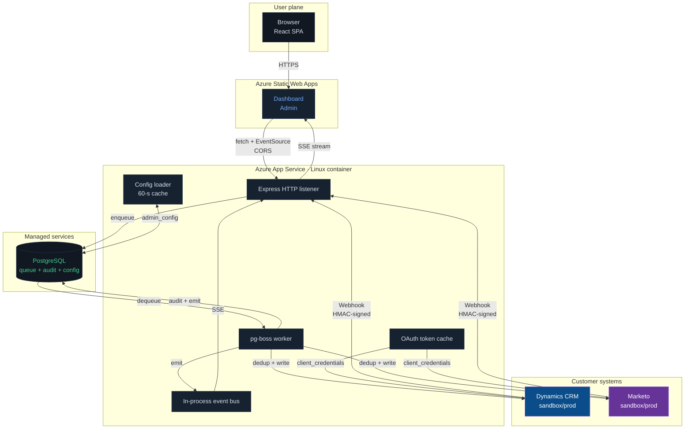
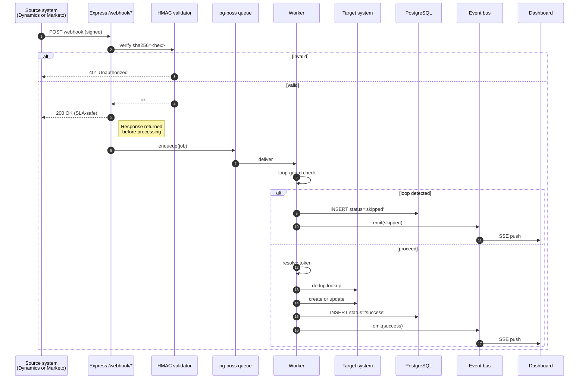
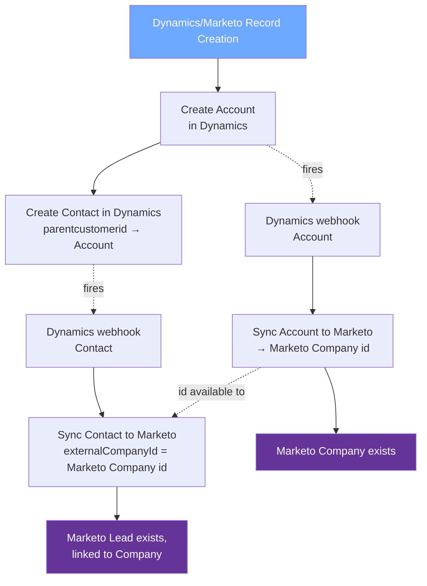
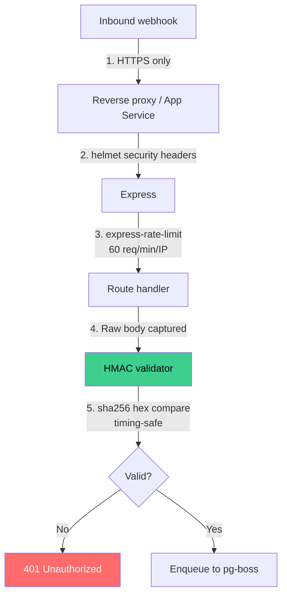
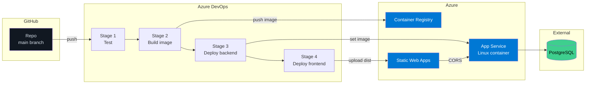

# Dynamics ↔ Marketo Sync

**Real-time, bidirectional data synchronisation between Microsoft Dynamics CRM
and Adobe Marketo — with a live observability dashboard and an admin console
that takes the integration from "engineering project" to "configurable
product."**

---

## Table of contents

- [At a glance](#at-a-glance)
- [Why this exists](#why-this-exists)
- [The demo in 30 seconds](#the-demo-in-30-seconds)
- [System architecture](#system-architecture)
- [End-to-end data flow](#end-to-end-data-flow)
- [Entities & field mapping](#entities--field-mapping)
- [Live dashboard](#live-dashboard)
- [Admin console](#admin-console)

- [Reliability & resilience](#reliability--resilience)
- [Security posture](#security-posture)
- [Scalability](#scalability)
- [Deployment model](#deployment-model)
- [Extensibility — adding a new field, entity, or system](#extensibility)
- [Frequently asked questions](#frequently-asked-questions)

---

## At a glance

| What it does | Why it matters |
|---|---|
| Two-way sync of Accounts, Contacts, and Leads between Dynamics CRM and Marketo | Eliminates manual double-entry; sales and marketing stop drifting apart |
| Preserves record relationships — a Contact linked to an Account arrives with the link intact | No orphan records; lead scoring and account-based marketing both work out of the box |
| **Contact-vs-Lead differentiator on every Marketo Person** — `crmEntityType` + `crmContactId` / `crmLeadId` | Marketo operators can filter Contacts vs Leads in Smart Lists with one rule, without guessing |
| **One-click "Sync with Company" bundle button** in the run page | Push a Contact/Lead together with their associated Account in a single sequential batch — preview first, then commit |
| Real-time — median end-to-end latency under 5 seconds | Reps see marketing data while a lead is still hot |
| Live dashboard with per-event field diff | Anyone can see what synced, when, and exactly which fields moved — no "why didn't this update?" tickets |
| Idempotent writes + deduplication | Replaying a webhook never creates duplicates |
| Loop-safe | The system can sync back and forth forever without thrashing |
| 863 automated tests across unit + integration | Confidence that changes don't regress |
| Container-ready for Azure / AWS / GCP | Ships as Docker; pipeline provided for Azure DevOps |

---

## Why this exists

Enterprise marketing teams live in **Marketo** (campaigns, lead scoring,
nurture flows). Enterprise sales teams live in **Dynamics CRM** (opportunities,
accounts, quotas). Both systems hold the same people and companies — and
without a reliable bridge between them, the two sides of the business
operate on fundamentally different truths.

The out-of-the-box connectors exist but are brittle: they lose records during
rate-limit storms, create duplicates on replay, can't express complex field
mappings, and give no visibility when something silently fails.

This product is that bridge, rebuilt around three principles:

1. **Observability first.** Every sync attempt is a row in the audit log and
   a live event on the dashboard. If it happened, you can see it.
2. **Idempotence always.** Every write is a dedup-aware upsert. Replay is
   safe. A webhook can arrive twice, ten times, or a month late — the
   outcome is identical.
3. **Configuration, not code.** Field mappings live in data, not in source.
   Adding a new field is a one-line JSON change. Rotating credentials is an
   admin UI form — no restart, no redeploy.

---

---

## System architecture



### Component responsibilities

| Component | Responsibility | Implementation |
|---|---|---|
| **React SPA** | Two-tab operator UI — Dashboard and Admin | Vite + React 18, served from Azure Static Web Apps |
| **Express listener** | Terminates HTTPS, validates webhook HMACs, exposes `/api/*` and the SSE stream | Express 4 + Helmet + express-rate-limit |
| **pg-boss worker** | Single long-running process that dequeues jobs, executes the 6-step sync pipeline, and emits bus events | pg-boss 9 on node-postgres |
| **Event bus** | In-process fan-out of sync results to every connected dashboard | Node `EventEmitter` |
| **Config loader** | 60-second-cached reader over `admin_config` with `process.env` fallback | postgres-js |
| **Token cache** | Per-system OAuth2 access-token cache with 60-s pre-expiry skew | Plain JS object |
| **PostgreSQL** | `admin_config` (credentials) + `sync_events` (audit log) + `pgboss` schema (queue) | Managed Postgres — one database for every durable piece |

---

## End-to-end data flow

### Inbound (external → internal)



**Invariants enforced by this flow:**

- Webhooks get a 200 response **before** any downstream work starts — so a
  slow queue never breaches the source system's webhook SLA.
- Unsigned or mis-signed requests never reach the queue.
- Every outcome (success, skip, fail) produces both an audit row and a live
  event. There are no silent successes or silent failures.

---

## Entities & field mapping

### Supported entities

| Entity | Dynamics | Marketo | Direction |
|---|---|---|---|
| **Contact** | `contact` | `lead` | Both |
| **Lead** | `lead` | `lead` (tagged) | Both |
| **Account** | `account` | `company` | Both |

### How mappings are expressed

Field mappings live in a single JSON file — [`src/config/fieldmap.json`](../src/config/fieldmap.json).
Adding a field is one line. No code, no deploy to change mapping logic.

Each entry has type `text | boolean | guid | choice | lookup | derived | literal`.
Choice and lookup entries are resolved at sync time against Dataverse metadata;
literal entries emit a fixed value (used for the Contact-vs-Lead signal).

```json
{
  "crmToMarketo": {
    "contact": {
      "firstName":     { "source": "firstname",     "type": "text" },
      "email":         { "source": "emailaddress1", "type": "text" },
      "crmEntityType": { "source": "@literal", "type": "literal", "value": "contact" },
      "crmContactId":  { "source": "contactid", "type": "guid" }
    }
  }
}
```

### Contact-vs-Lead differentiation in Marketo

Marketo represents both Contacts and Leads as a single Person object. Every
sync from CRM stamps three fields on the Marketo record so operators can
filter clean:

| Marketo field | Value |
|---|---|
| `crmEntityType` | `"contact"` or `"lead"` |
| `crmContactId`  | Dynamics `contactid` (Contact rows) |
| `crmLeadId`     | Dynamics `leadid` (Lead rows) |

A Smart List rule of `crmEntityType is "contact"` is all an operator needs to
isolate CRM-Contact-origin Persons. The IDs are also there for programmatic
filters (`crmContactId is not empty`).

Inside the SPA, the same signal surfaces as:
- An entity-type filter chip in the **Logs** tab (Contact / Lead / Account / All).
- A coloured Type badge on every record card in **SyncView**.

Role transitions (Lead → Contact or vice versa) follow the rest of the
authority model: last sync wins.

### Mapping in action — a Contact going Dynamics → Marketo

```mermaid
flowchart LR
    subgraph D[Dynamics payload]
        D1[emailaddress1<br/>alice@acme.com]
        D2[firstname<br/>Alice]
        D3[lastname<br/>Smith]
        D4[companyname<br/>Acme Corp]
        D5[jobtitle<br/>VP Engineering]
        D6[telephone1<br/>555-1234]
    end

    subgraph M[Marketo payload]
        M1[email<br/>alice@acme.com]
        M2[firstName<br/>Alice]
        M3[lastName<br/>Smith]
        M4[company<br/>Acme Corp]
        M5[title<br/>VP Engineering]
        M6[phone<br/>555-1234]
    end

    D1 --> M1
    D2 --> M2
    D3 --> M3
    D4 --> M4
    D5 --> M5
    D6 --> M6

    style D fill:#0b4d8a,color:#fff
    style M fill:#663399,color:#fff
```

The dashboard renders exactly this diagram for every event, in real time,
computed from the payload. Operators never have to guess what got mapped.

### Associated data — the Contact-with-Account case

When a Contact has a parent Account, the sync handles the relationship
automatically:



**What the operator sees:** two dashboard rows — Account (first), then Contact
— with the foreign key clearly stamped. No orphan records, no manual
reconciliation, ever.

---

## Manual "Sync with Company" bundle

The **run page** (SyncView) has a dedicated Bundle Sync row above the two
tables. Operators can multi-select Contacts or Leads on the Dynamics side and
click **Sync with Company** to push each selected record together with its
associated Account in one sequential batch.

```
┌─────────────────────────────────────────────────────────────────────────┐
│ 🏢  Sync with Company                                                   │
│     Push the selected contacts together with their associated Account.  │
│     (3 selected)                                                [Sync]   │
└─────────────────────────────────────────────────────────────────────────┘
```

The flow is **preview → confirm → push**:

1. **Preview modal** — aggregate counts at the top (`With company`,
   `Person only`, `Will skip`, `Errors`) plus a collapsible per-row list
   showing the exact Account and Person bodies that would be sent. No writes
   happen at this stage.
2. **Confirm** — modal switches to a spinner: "Syncing N of M…"
3. **Result modal** — final summary with Persons synced, Companies synced,
   Skipped, Failed. A "View failures" link deep-jumps into the Logs tab
   pre-filtered by `reason_criterion=manual:sync-with-company`.

### Resolution rules

| Selected record state | Outcome |
|---|---|
| Contact has a parent Account that resolves | Account synced first, then Contact (with company linkage in Marketo) |
| Contact has no parent Account at all | Person-only — Contact synced without a Company write |
| Contact's parent Account FK is broken (404 / inactive) | **Skip** — `manual:sync-with-company:no-resolvable-account` |
| Lead has a `companyname` / `accountnumber` that resolves | Account synced first, then Lead |
| Lead has no company info at all | Person-only |
| Lead's company info doesn't resolve to a real CRM Account | **Skip** |
| Account write fails mid-row | Person write still attempted — Marketo dedups Company on the fly via `lead.company` |

Every leg writes its own audit row to `sync_events` with
`reason_category='manual'` so manual syncs are easy to filter in the Logs
tab and outbound webhook deliveries.

The endpoints are also callable directly:

| Endpoint | Purpose |
|---|---|
| `POST /api/transfer/with-company/preview` | Read-only resolution + projection (aggregate summary + per-row bodies) |
| `POST /api/transfer/with-company`         | Live sequential push |

Body: `{ entity: 'contact'\|'lead', sourceIds: [string, ...] }`. Cap of 50 rows per request.

---

## Live dashboard

```
┌─────────────────────────────────────────────────────────────────────────┐
│ Dynamics ↔ Marketo Sync                    [Dashboard] [Admin]          │
├─────────────────────────────────────────────────────────────────────────┤
│ LIVE SYNC FEED                                    3 shown · 147 total   │
├─────────────────────────────────────────────────────────────────────────┤
│ ▼ dynamics → marketo  [SUCCESS] CONTACT   alice@acme.com         14:22:07
│     ┌─────── dynamics (source) ────────┐  ┌──── marketo (target) ────┐  │
│     │ emailaddress1  alice@acme.com    │  │ email      alice@acme.com│  │
│     │ firstname      Alice             │  │ firstName  Alice         │  │
│     │ lastname       Smith             │  │ lastName   Smith         │  │
│     │ companyname    Acme Corp         │  │ company    Acme Corp     │  │
│     │ jobtitle       VP Engineering    │  │ title      VP Engineering│  │
│     └──────────────────────────────────┘  └──────────────────────────┘  │
│ ▶ dynamics → marketo  [SUCCESS] ACCOUNT   Acme Corp Ltd 1729...  14:22:05
│ ▶ marketo → dynamics  [SKIPPED] CONTACT   bob@example.com        14:20:11
│                                                                         │
│                                            [← Prev]  Page 1/6  [Next →] │
└─────────────────────────────────────────────────────────────────────────┘
```

Every row shows direction, status, entity type, key identifier, and
timestamp. Expand any row for the full source-to-target field diff. The feed
is driven by **Server-Sent Events** — new rows prepend the instant a sync
completes, with no polling, no WebSocket handshake, no page refresh.

Paginated history (all 147 events in the screenshot) is served straight from
PostgreSQL, so you can scroll back through weeks of activity.

---

## Admin console

The admin page is the **entire runtime configuration surface** of the
product. Every credential the service needs is editable here.

```
┌─ CREDENTIALS ────────────────────────────────────────────────────────┐
│ Values stored in PostgreSQL admin_config. Picked up by the running     │
│ service within 60 seconds — no restart needed.                        │
├─ Dynamics ───────────────────────────────────────────────────────────┤
│  DYNAMICS_TENANT_ID        •••• c4f2                      [Edit]     │
│  DYNAMICS_CLIENT_ID        •••• a93b                      [Edit]     │
│  DYNAMICS_CLIENT_SECRET    •••• f2q8                      [Edit]     │
│  DYNAMICS_RESOURCE_URL     https://contoso.crm.dynamics.com [Edit]   │
├─ Marketo ────────────────────────────────────────────────────────────┤
│  MARKETO_BASE_URL          https://123-abc-456.mktorest.com [Edit]   │
│  MARKETO_CLIENT_ID         •••• 91xc                      [Edit]     │
│  MARKETO_CLIENT_SECRET     •••• 22mp                      [Edit]     │
├─ Webhooks ───────────────────────────────────────────────────────────┤
│  DYNAMICS_WEBHOOK_SECRET   •••• 7c3e                      [Edit]     │
│  MARKETO_WEBHOOK_SECRET    •••• 9fa1                      [Edit]     │
└──────────────────────────────────────────────────────────────────────┘
```

**Properties of the admin layer that matter:**

- Secrets are **masked to the last 4 characters** on display. Full values
  never traverse the network after save.
- Saves are **hot** — the loader re-reads the `admin_config` table inside a
  60-second cache window. No restart, no redeploy, no ops page.
- Writes go straight to the `admin_config` table in PostgreSQL, which bypasses
  Row-Level Security via the service_role key (server-side only — never
  exposed to the browser).

---

---

## Reliability & resilience

| Mechanism | How it works |
|---|---|
| **Idempotent writes** | Every write is preceded by a dedup lookup (by email for people, by name for accounts). Result is always a `create` or `update` — never an unintended duplicate. |
| **Loop prevention** | Every write stamps `syncSource` / `cr_syncsource` on the target record. When the target system's webhook fires back, the loop guard sees its own origin and short-circuits — preventing ping-pong. |
| **Retry with backoff** | pg-boss retries failed jobs 3 times with exponential backoff. 429 rate-limit responses honour `Retry-After`. |
| **Dead-letter queue** | Jobs that fail all retries get a `failed` row in the audit log with full error stack. Replay is one function call. |
| **Graceful shutdown** | SIGTERM stops accepting new HTTP traffic, drains the in-flight queue, closes the DB pool, then exits. Rolling deploys lose zero events. |
| **Monitoring heartbeat** | Every 60 seconds: DLQ depth + 15-minute error rate checked against thresholds. Breaches post to a Slack-compatible webhook. |
| **Health + readiness endpoints** | `/health` and `/ready` for platform-native load-balancer probes. |

---

## Security posture



| Surface | Control |
|---|---|
| Webhooks | HMAC-SHA256 signature verification, timing-safe comparison, 1 MB body limit, 60 req/min rate limit per IP |
| HTTP headers | `helmet` — HSTS, X-Frame-Options, X-Content-Type-Options, Referrer-Policy, etc. |
| TLS | Terminated at Azure App Service edge; all upstream API calls are HTTPS |
| OAuth tokens | Cached in-process with a 60-second pre-expiry skew; never persisted to disk or logs |
| Credentials at rest | Stored in PostgreSQL; access gated by the `service_role` JWT held only by the backend process |
| Secret exposure | Admin UI masks everything except the last 4 characters of secrets |
| CORS | Opt-in via `ALLOWED_ORIGINS` env var; webhook routes are not CORS-exposed |
| Logs | JSON-structured; secret values are never fields in any log line |
| Supply chain | Pinned major versions, `npm audit` in CI |

---

## Scalability

| Dimension | Current design | How to scale |
|---|---|---|
| **Webhook ingestion** | 60 req/min/IP rate-limited; single Express process | Horizontal scale behind a load balancer — each instance is stateless |
| **Worker throughput** | `SYNC_CONCURRENCY=5` (configurable) × Marketo's 100-req/20-s bucket | Increase concurrency; run multiple worker instances — pg-boss distributes automatically via Postgres row locks |
| **Audit log writes** | Postgres via postgres-js; one INSERT per sync | Scales with PostgreSQL tier; move to partitioned table at ~10M rows |
| **Dashboard viewers** | In-process EventEmitter, `setMaxListeners(100)` | Swap bus for Postgres `LISTEN`/`NOTIFY` to fan out across N backend instances |
| **Token refresh** | One cache per process | Each instance refreshes independently; no coordination needed |

The architecture is intentionally **stateless above the queue and database**,
which means every axis scales by adding replicas — no coordination, no
leader election, no sticky sessions.

---

## Deployment model



**Deployment characteristics:**

- **Zero downtime**: App Service rolls the new container in behind the load
  balancer; in-flight requests complete on the old instance.
- **Branch-gated**: only pushes to `main` / `master` deploy. PRs run the Test
  stage only.
- **Rollback**: point App Service at an earlier image tag — one click.
- **Environment parity**: local dev, CI, and production all run the same
  Docker image.
- **Config externalised**: every runtime knob is an env var or an
  `admin_config` row; the image is environment-agnostic.

Full runbook with `az` commands, App Service settings, and pipeline variables:
[docs/AZURE_DEPLOY.md](AZURE_DEPLOY.md).

---

## Extensibility

### Add a new field to sync

1. Edit [`src/config/fieldmap.json`](../src/config/fieldmap.json).
2. Add one line under `dynamics_to_marketo` and one under `marketo_to_dynamics`.
3. Deploy. Done.

```json
"contact": {
  "dynamics_to_marketo": {
    "...": "...",
    "donotemail": "unsubscribed"
  }
}
```

### Add a new entity type (e.g. Opportunity)

1. Add `opportunity` section to [`fieldmap.json`](../src/config/fieldmap.json).
2. Add writer + dedup functions (mirror the existing Account pattern — ~60
   lines each).


### Add a new system (e.g. HubSpot instead of Marketo)

1. New `src/auth/hubspot.js` (OAuth2 client_credentials or API key).
2. New `src/writers/hubspot.js` with create/update + 429 handling.
3. Extend `fieldmap.json` with `hubspot_to_dynamics` / `dynamics_to_hubspot`.
4. New `/webhook/hubspot` route in the Express listener.

The worker pipeline (`loopGuard → dedup → fieldMap → write → audit → emit`)
stays identical — only the edge adapters change.

---

## Frequently asked questions

**Q: What happens if Dynamics goes down for an hour?**
Queued jobs sit in PostgreSQL until the target is reachable again, retrying with
backoff. No events are lost. The dashboard shows the failures as they occur
and the successful recoveries after.

**Q: What stops an infinite sync loop?**
Every write stamps its origin (`syncSource`) on the target record. When the
target system's webhook fires back, the loop guard sees `syncSource === self`
and skips. The skip is recorded as a `skipped` event on the dashboard — so
loops are visible when they're prevented.

**Q: If the same webhook fires twice, will I get two records?**
No. Every write is preceded by a dedup lookup by email (or name for
accounts). The second attempt becomes an `update` to the existing record.

**Q: How long does a sync take, end to end?**
Median ~3–5 seconds from webhook receipt to target-system write, dominated
by the two outbound HTTPS calls (token fetch + write). The dashboard SSE
latency from worker completion to browser render is <100ms.

**Q: Can we restrict which records sync?**
Yes — the field mapper and the loop guard are already pluggable. A filter
hook can be added to the worker in ~10 lines to drop events matching a
predicate (e.g. only contacts in certain business units).

**Q: Where's the source of truth if the two systems disagree?**
Whoever wrote last wins. This matches the behaviour of Dynamics' and
Marketo's native bulk imports, and is the cheapest conflict model that
works for 95% of real-world data. Richer conflict policies (field-level
merge, per-system priorities) are straightforward to add.

**Q: Does this support Marketo's Named Accounts / ABM?**
The current Account ↔ Company mapping uses Marketo's standard Companies
API, which is sufficient for 99% of sync use cases. Named Accounts (a paid
Marketo ABM feature) uses a separate API and would be a focused add-on —
the sync pipeline wouldn't change, only the writer and dedup for the
`account` entity.

**Q: Can the Admin page be locked down?**
Yes. For the POC it's unauthenticated by design (fast demo). In production
it would sit behind either Azure AD SSO (App Service has a built-in auth
layer) or a reverse-proxy auth middleware — a ~20-line change.

---

## Further reading

| Document | Contents |
|---|---|
| [README](../README.md) | Quick start for developers |
| [AZURE_DEPLOY.md](AZURE_DEPLOY.md) | End-to-end Azure deployment runbook |
| [CREDENTIALS_SETUP.md](CREDENTIALS_SETUP.md) | How to create the Dynamics and Marketo API credentials |
| [runbook.md](runbook.md) | Operational runbook — replay DLQ, investigate failures |
| [ARCHITECTURE.md](ARCHITECTURE.md) | Deeper technical reference for engineers |
